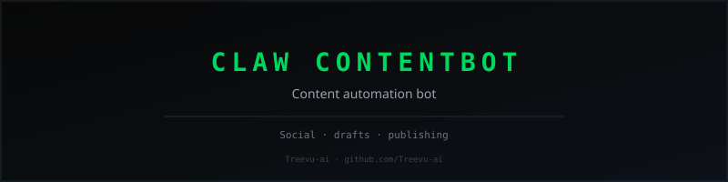
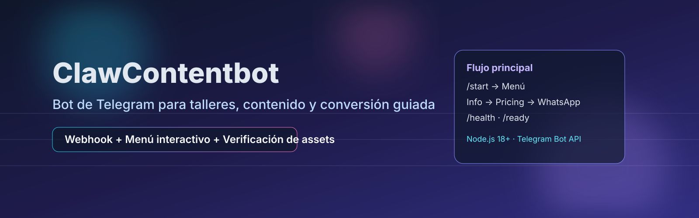

<!-- readme-hero -->
<div align="center">



</div>

<div align="center">
  

  # ClawContentbot
  ### Bot de Telegram para convertir interés en inscripción con contenido guiado

  [](https://github.com/Treevu-ai/ClawContentbot/actions/workflows/pages/pages-build-deployment)
  
  
  
</div>

---

## Tabla de contenidos

- [Resumen](#resumen)
- [Características clave](#características-clave)
- [Arquitectura rápida](#arquitectura-rápida)
- [Quickstart](#quickstart)
- [Configuración](#configuración)
- [Uso](#uso)
- [Ejemplos](#ejemplos)
- [Recursos del repositorio](#recursos-del-repositorio)
- [Contribuir](#contribuir)
- [Código de conducta y licencia](#código-de-conducta-y-licencia)

## Resumen

**ClawContentbot** es un bot de Telegram orientado a talleres y campañas educativas. Expone menú interactivo, mensajes de información/precio, y endpoints de salud (`/health`, `/ready`) para despliegue en Railway u otros entornos compatibles con webhooks.

## Características clave

<table>
  <tr>
    <td width="50%">
      <h3>🤖 Bot con menú guiado</h3>
      <p>Flujo con botones inline para info del taller, precios/pago y contacto por WhatsApp.</p>
    </td>
    <td width="50%">
      <h3>🩺 Endpoints operativos</h3>
      <p><code>/health</code> y <code>/ready</code> para monitoreo de disponibilidad y configuración de pago.</p>
    </td>
  </tr>
  <tr>
    <td width="50%">
      <h3>⚙️ Configuración por JSON + ENV</h3>
      <p>Contenido principal en <code>workshop.config.json</code> y secretos/valores sensibles vía variables de entorno.</p>
    </td>
    <td width="50%">
      <h3>✅ Validaciones incluidas</h3>
      <p>Scripts de verificación para sincronía de landing/slides y pruebas con <code>node --test</code>.</p>
    </td>
  </tr>
</table>

## Arquitectura rápida

<div align="center">
  
</div>

## Quickstart

```bash
cd claw-content-bot
npm install
cp .env.example .env
npm start
```

> Requisito: **Node.js 18+**

## Configuración

Variables de entorno principales (ver `claw-content-bot/.env.example`):

| Variable | Requerida | Descripción |
|---|---:|---|
| `TELEGRAM_BOT_TOKEN` | Sí | Token del bot de Telegram. |
| `PORT` | No | Puerto local (en Railway suele venir inyectado). |
| `WEBHOOK_URL` | No | URL completa del webhook (`https://.../<TOKEN>`). |
| `RAILWAY_PUBLIC_DOMAIN` | No | Dominio público cuando no se define `WEBHOOK_URL`. |
| `TALLER_WHATSAPP` | No | Número mostrado en mensajes de contacto. |
| `PAYMENT_INFO_MARKDOWN` | No | Bloque completo de datos de pago en Markdown. |
| `PAYMENT_BANCO` / `PAYMENT_CUENTA` / `PAYMENT_CCI` / `PAYMENT_TITULAR` | No (en conjunto) | Alternativa estructurada para datos de pago. |

## Uso

Scripts disponibles desde `claw-content-bot/`:

```bash
npm start           # Ejecuta bot + servidor Express
npm test            # Pruebas unitarias (node --test)
npm run verify      # Verifica sincronía de assets y slides
npm run verify:assets
npm run verify:slides
```

## Ejemplos

### Comandos útiles

```bash
curl http://localhost:3000/health
curl http://localhost:3000/ready
```

### Vista del bot / UI

- Banner del proyecto: `assets/banner-clawcontentbot.svg`
- Diagrama técnico: `assets/arquitectura-bot.svg`
- Placeholder de captura de Telegram: _pendiente de adjuntar screenshot real del chat en producción/local_.

## Recursos del repositorio

- `claw-content-bot/` → código del bot, tests y scripts de verificación.
- `docs/index.html` → landing pública del taller.
- `taller-mayo-2026/operacion/README.md` → guías operativas (embudo, métricas, token, UTMs).
- `taller-mayo-2026/promocion/copy-promocion.md` → calendario/copy de contenidos.

## Contribuir

1. Haz fork o crea una rama de trabajo.
2. Mantén los cambios acotados y con contexto.
3. Ejecuta, como mínimo:

```bash
cd claw-content-bot
npm test
npm run verify
```

4. Abre un PR describiendo objetivo, alcance y validación.

## Código de conducta y licencia

- **Código de conducta:** actualmente no hay un `CODE_OF_CONDUCT.md` en el repositorio.
- **Licencia:** actualmente no hay archivo `LICENSE` en el repositorio.

Si deseas, se puede añadir ambos en un siguiente PR para formalizar gobernanza y términos de uso.
